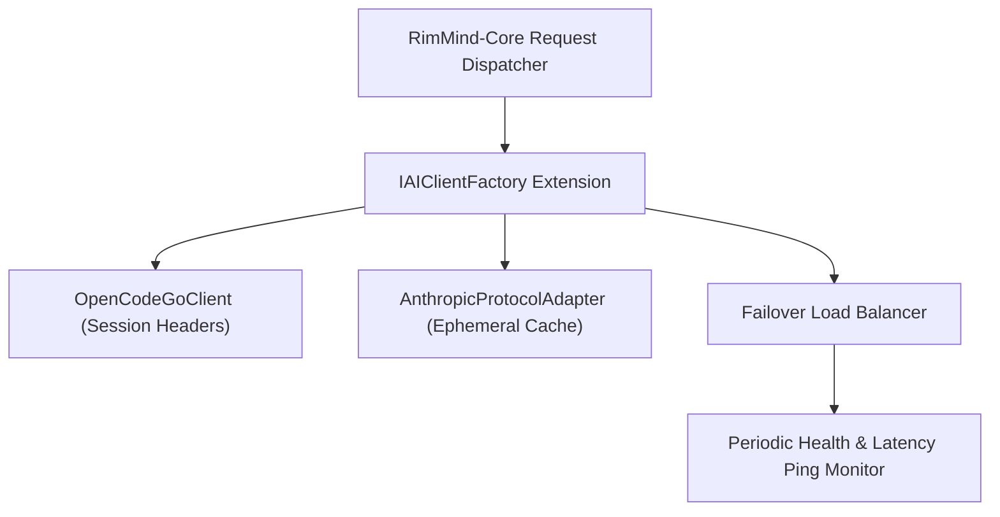

<div align="center">

# RimMind-Extension-ModelService 🌐
### Extended Model Gateways, OpenCode Go Subscription & Anthropic Prompt Caching for RimWorld 1.6

**English** | [简体中文](README_zh.md)

<p>
  <a href="https://rimworldgame.com/"></a>
  <a href="https://github.com/mcocdaa/RimWorld-RimMind-Mod-Core"></a>
  <a href="#"></a>
  <a href="LICENSE"></a>
</p>

<p><em>Enterprise multi-provider connectivity: OpenCode Go subscription, Anthropic ephemeral KV caching, and failover load balancing.</em></p>

</div>

---

## 📖 Overview

**RimMind-Extension-ModelService** extends `RimMind-Core` with advanced cloud subscription gateways, cutting-edge caching protocols, and zero-downtime failover load balancing.

### Key Highlights
- **OpenCode Go Subscription Direct Access**: One-click subscription preset (`https://opencode.ai/zen/go/v1`) with automatic session isolation headers (`x-opencode-session`).
- **Anthropic Protocol Adapter**: Implements native Anthropic `messages` protocol with `cache_control: {"type": "ephemeral"}` markings on static L0/L1 prefix layers, maximizing hardware-level KV cache reuse.
- **Multi-Endpoint Latency Ping & Failover**: Monitors endpoint health with millisecond ping checks and transparently shifts requests to backup providers if a primary endpoint returns HTTP 429 / 5xx errors.

---

## 🎮 In-Game Showcase


*High-speed gateway settings: Testing real-time connection latency with OpenCode Go and configuring automatic endpoint failover.*

---

## 🏛️ Gateway & Protocol Architecture



---

## 🛠️ Installation & Load Order

```text
1. Harmony
2. Core (Vanilla RimWorld)
3. RimMind-Core
4. RimMind-Extension-ModelService
```

---

## 🧪 Developer Guide & Testing

Run unit tests directly:

```powershell
dotnet test RimMind-Extension-ModelService/Tests/RimMindModelService.Tests.csproj -c Release
```

---

## 📜 License

Licensed under the [MIT License](LICENSE).
