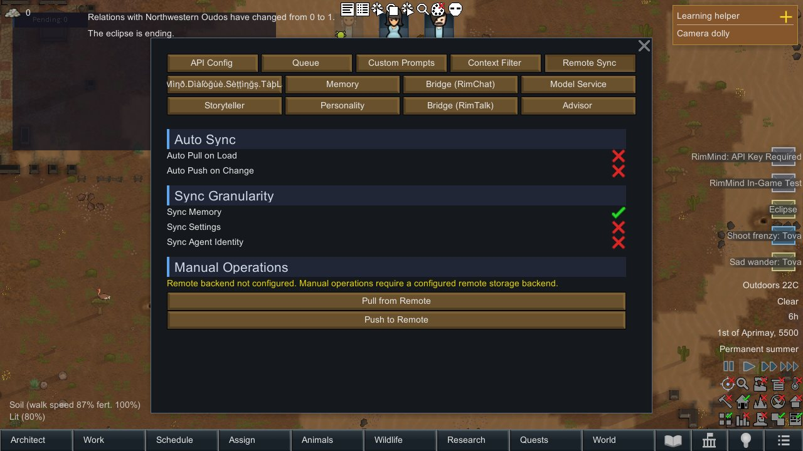
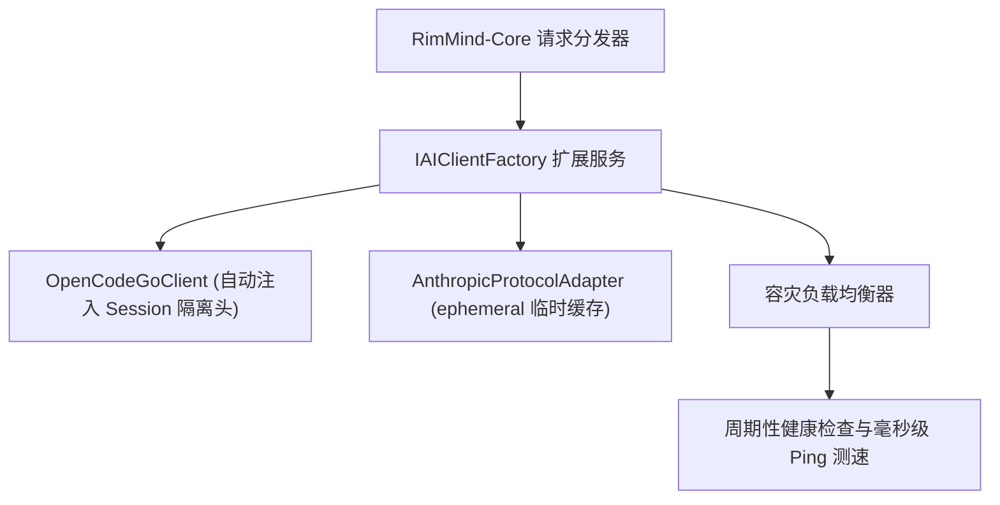

<div align="center">

# RimMind-Extension-ModelService 🌐
### 专为 RimWorld 1.6 打造的扩展模型网关、OpenCode Go 订阅直连与 Anthropic 缓存协议适配

[English](README.md) | **简体中文**

<p>
  <a href="https://rimworldgame.com/"></a>
  <a href="https://github.com/mcocdaa/RimWorld-RimMind-Mod-Core"></a>
  <a href="#"></a>
  <a href="LICENSE"></a>
</p>

<p><em>工业级多模型接入中枢：OpenCode Go 订阅直连、Anthropic 临时缓存标记与无感容灾负载均衡。</em></p>

</div>

---

## 📖 模块概览

**RimMind-Extension-ModelService** 是 `RimMind-Core` 的高级扩展插件。它引入了极速云端订阅直连、尖端大模型缓存协议以及零停机的多节点容灾负载均衡机制。

### 核心特性
- **OpenCode Go 订阅直连**：一键切换 OpenCode Go 专属端点（`https://opencode.ai/zen/go/v1`），自动注入会话隔离请求头（`x-opencode-session`），畅享超低延迟。
- **Anthropic 原生协议适配器**：支持 Anthropic `messages` 原生协议，在 L0/L1 静态上下文层精准注入 `cache_control: {"type": "ephemeral"}` 临时缓存标记，将硬件级 KV 缓存复用发挥到极致。
- **多端点毫秒级延迟测速与容灾漂移**：后台周期性探活多节点健康度，当主端点遭遇 HTTP 429 速率限制或网络断连时，秒级无缝自动切换至备用服务商。

---

## 🎮 实机特性展示


*扩展模型网关设置界面：实时监测与 OpenCode Go 端点的毫秒级网络延迟，并配置多端点自动容灾策略。*

---

## 🏛️ 网关与协议架构



---

## 🛠️ 安装与加载顺序

```text
1. Harmony
2. Core (RimWorld 原版)
3. RimMind-Core
4. RimMind-Extension-ModelService
```

---

## 🧪 开发者测试指南

运行单元测试：

```powershell
dotnet test RimMind-Extension-ModelService/Tests/RimMindModelService.Tests.csproj -c Release
```

---

## 📜 开源协议

本项目采用 [MIT License](LICENSE) 开源许可证。
