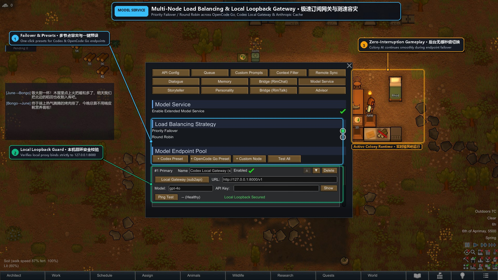
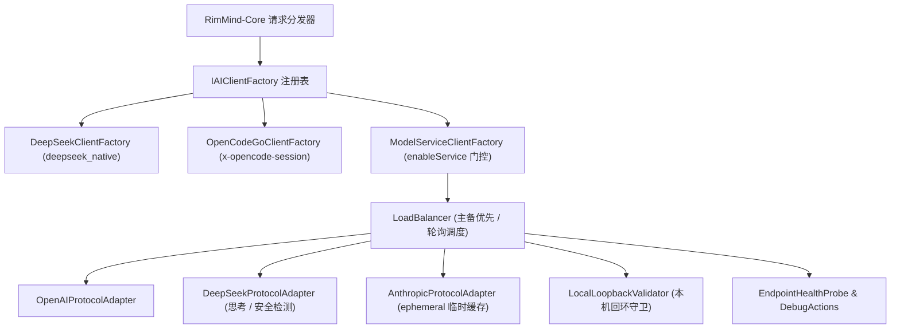

<div align="center">

# RimMind-Extension-ModelService 🌐
### 专为 RimWorld 1.6 & 1.7 打造的扩展模型网关、DeepSeek 原生协议、语音接口与 Anthropic 缓存适配

[English](README.md) | **简体中文**

<p>
  <a href="https://rimworldgame.com/"></a>
  <a href="https://github.com/RimWorld-RimMind-Mod/RimWorld-RimMind-Mod-Core"></a>
  <a href="#"></a>
  <a href="LICENSE"></a>
</p>

<p><em>工业级多模型接入中枢：DeepSeek 原生思考/内容安全、TTS/ASR 语音接口、OpenCode Go 订阅直连、Anthropic 临时缓存标记、本地回环安全网关与无感容灾负载均衡。</em></p>

</div>

---

## 📖 模块概览

**RimMind-Extension-ModelService** 是 `RimMind-Core` 的高级模型服务扩展模组。它引入了极速云端订阅直连、本地订阅代理回环安全防护、尖端大模型缓存协议以及零停机的多节点容灾负载均衡机制。

### 核心特性
- **DeepSeek 原生 V4 协议适配（`deepseek` / `deepseek_native`）**：实现统一 `IModelProtocol`（`DeepSeekProtocolAdapter` 与 `DeepSeekClientFactory`），将 Core `ReasoningEffort` 语义自动映射为 `thinking` 与 `reasoning_effort`，支持 `safety_check`（`high` 级别）与清洗后的 `user_id`、自动消解参数冲突（移除 `temperature`、`tool_choice: required->auto`、`json_schema->json_object`）、在多轮工具调用历史中强制保留助手消息 `reasoning_content`，并精准分流 HTTP `402` 欠费故障转移与 `400 Content Exists Risk` 内容安全拦截（不重试、不熔断）。
- **DeepSeek 语音合成与识别服务（`ISpeechSynthesizer` / `ISpeechRecognizer`）**：通过 `RimMindHttpClientPool.NoRedirect` 向 `RimMindAPI.Ext` 注册正交扩展接口 `/v1/tools/tts`（`DeepSeekSpeechSynthesizer`）与 `/v1/tools/asr`（`DeepSeekSpeechRecognizer`）。
- **OpenCode Go 订阅直连**：通过 `OpenCodeGoClientFactory` 一键切换 OpenCode Go 专属端点（`https://opencode.ai/zen/go/v1`），自动注入会话隔离请求头（`x-opencode-session`），畅享超低延迟。
- **Anthropic 原生协议适配器**：支持 Anthropic `messages` 原生协议，在 L0/L1 静态上下文层精准注入 `cache_control: {"type": "ephemeral"}` 临时缓存标记，将硬件级 KV 缓存复用发挥到极致。
- **本地订阅代理回环安全校验**：通过 `LocalLoopbackValidator` 强制校验本地订阅网关（Codex、Sub2API、NewAPI）仅绑定本机回环地址（`127.0.0.1`、`localhost`、`::1`），严防本地代理凭据向公网泄露。
- **多端点毫秒级测速与容灾负载均衡**：支持主备故障转移（`PriorityFailover`）与轮询（`RoundRobin`）调度、熔断隔离（`LoadBalancer`）、异步 RTT 延迟探针（`EndpointHealthProbe`）以及开发者模式批量探活诊断（`ModelServiceDebugActions`）。

---

## 🎮 实机特性展示


*扩展模型网关设置实机：配置 `Priority Failover` / `Round Robin` 负载均衡策略、一键添加 `Codex Preset` 与 `OpenCode Go Preset` 预设节点，并通过 `Local Loopback Secured`（`127.0.0.1:8000`）本机回环安全校验。*

---

## 🏛️ 网关与协议架构


```mermaid
flowchart TD
    Core["RimMind-Core 请求分发器"] --> Factory["IAIClientFactory 注册表"]
    Factory --> DeepSeekFactory["DeepSeekClientFactory (deepseek_native)"]
    Factory --> OpenCode["OpenCodeGoClientFactory (x-opencode-session)"]
    Factory --> Extended["ModelServiceClientFactory (enableService 门控)"]
    Extended --> Balancer["LoadBalancer (主备优先 / 轮询调度)"]
    Balancer --> OpenAI["OpenAIProtocolAdapter"]
    Balancer --> DeepSeek["DeepSeekProtocolAdapter (思考 / 安全检测)"]
    Balancer --> Anthropic["AnthropicProtocolAdapter (ephemeral 临时缓存)"]
    Balancer --> Loopback["LocalLoopbackValidator (本机回环守卫)"]
    Balancer --> Health["EndpointHealthProbe & DebugActions"]
```

---

## 🛠️ 安装与加载顺序

```text
1. Harmony
2. Core (RimWorld 原版)
3. RimMind-Core
4. RimMind-Extension-ModelService
```

---

## ⚙️ 核心设置项

位于 **选项 -> Mod 设置 -> RimMind - 模型服务**（或 RimMind 设置中的 **模型服务** 页签）：

| 设置项 | 默认值 | 说明 |
|---|---|---|
| **启用扩展模型服务** | `开启` | 控制 `extended_service` 多端点路由网关的总开关 |
| **负载均衡策略** | `PriorityFailover` | 支持按优先级主备故障转移（`PriorityFailover`）或均匀轮询（`RoundRobin`） |
| **协议提供商类型** | `OpenAICompatible` | 支持 `OpenAICompatible`、`AnthropicClaude`、`DeepSeekOfficial`、`LocalSubscriptionGateway`、`OpenCodeGo` |
| **思考模式与安全等级 (DeepSeek)** | `Auto / High` | 按节点独立配置 `thinkingPolicy`（自动/开启/关闭）与 `safetyLevel`（标准/高安全 `safety_check`） |
| **端点优先级与启用状态** | `1 / 开启` | 独立配置每个端点的故障转移优先级权重与参与状态 |
| **一键延迟 Ping 测速** | — | 异步发送 HTTP 健康探针测量毫秒级 RTT 延迟并更新端点健康度 |

---

## 🧪 开发者测试指南

在仓库根目录下编译并运行单元测试：

```powershell
dotnet build RimMind-Extension-ModelService/Source/RimMindModelService.csproj -c Release
dotnet test RimMind-Extension-ModelService/Tests/RimMindModelService.Tests.csproj -c Release
```

---

## 📜 开源协议

本项目采用 [MIT License](LICENSE) 开源许可证。
